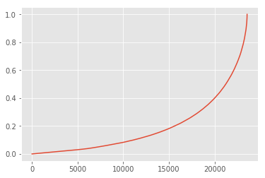

# 销售数据分析-python
### 引入数据分析包、导入数据


```python
import numpy as np
import pandas as pd
import matplotlib.pyplot as plt
%matplotlib inline
```


```python
filename = 'CDNOW_master.txt'
#列数重新命名
names = ['user_id','order_dt','order_product','order_amount']
data = pd.read_table(filename,names = names,sep='\s+')
```


```python
data.head()
```


<div>
<table border="1" class="dataframe">
  <thead>
    <tr style="text-align: right;">
      <th></th>
      <th>user_id</th>
      <th>order_dt</th>
      <th>order_product</th>
      <th>order_amount</th>
    </tr>
  </thead>
  <tbody>
    <tr>
      <th>0</th>
      <td>1</td>
      <td>19970101</td>
      <td>1</td>
      <td>11.77</td>
    </tr>
    <tr>
      <th>1</th>
      <td>2</td>
      <td>19970112</td>
      <td>1</td>
      <td>12.00</td>
    </tr>
    <tr>
      <th>2</th>
      <td>2</td>
      <td>19970112</td>
      <td>5</td>
      <td>77.00</td>
    </tr>
    <tr>
      <th>3</th>
      <td>3</td>
      <td>19970102</td>
      <td>2</td>
      <td>20.76</td>
    </tr>
    <tr>
      <th>4</th>
      <td>3</td>
      <td>19970330</td>
      <td>2</td>
      <td>20.76</td>
    </tr>
  </tbody>
</table>
</div>


```python
data.describe()
```


<div>
<table border="1" class="dataframe">
  <thead>
    <tr style="text-align: right;">
      <th></th>
      <th>user_id</th>
      <th>order_dt</th>
      <th>order_product</th>
      <th>order_amount</th>
    </tr>
  </thead>
  <tbody>
    <tr>
      <th>count</th>
      <td>69659.000000</td>
      <td>6.965900e+04</td>
      <td>69659.000000</td>
      <td>69659.000000</td>
    </tr>
    <tr>
      <th>mean</th>
      <td>11470.854592</td>
      <td>1.997228e+07</td>
      <td>2.410040</td>
      <td>35.893648</td>
    </tr>
    <tr>
      <th>std</th>
      <td>6819.904848</td>
      <td>3.837735e+03</td>
      <td>2.333924</td>
      <td>36.281942</td>
    </tr>
    <tr>
      <th>min</th>
      <td>1.000000</td>
      <td>1.997010e+07</td>
      <td>1.000000</td>
      <td>0.000000</td>
    </tr>
    <tr>
      <th>25%</th>
      <td>5506.000000</td>
      <td>1.997022e+07</td>
      <td>1.000000</td>
      <td>14.490000</td>
    </tr>
    <tr>
      <th>50%</th>
      <td>11410.000000</td>
      <td>1.997042e+07</td>
      <td>2.000000</td>
      <td>25.980000</td>
    </tr>
    <tr>
      <th>75%</th>
      <td>17273.000000</td>
      <td>1.997111e+07</td>
      <td>3.000000</td>
      <td>43.700000</td>
    </tr>
    <tr>
      <th>max</th>
      <td>23570.000000</td>
      <td>1.998063e+07</td>
      <td>99.000000</td>
      <td>1286.010000</td>
    </tr>
  </tbody>
</table>
</div>


```python
data.info()
```

    <class 'pandas.core.frame.DataFrame'>
    RangeIndex: 69659 entries, 0 to 69658
    Data columns (total 4 columns):
    user_id          69659 non-null int64
    order_dt         69659 non-null int64
    order_product    69659 non-null int64
    order_amount     69659 non-null float64
    dtypes: float64(1), int64(3)
    memory usage: 2.1 MB


```python
data['order_dt'] = pd.to_datetime(data.order_dt,format='%Y%m%d')
data['month'] = data.order_dt.values.astype('datetime64[M]')
```


```python
data.head()
```


<div>
<table border="1" class="dataframe">
  <thead>
    <tr style="text-align: right;">
      <th></th>
      <th>user_id</th>
      <th>order_dt</th>
      <th>order_product</th>
      <th>order_amount</th>
      <th>month</th>
    </tr>
  </thead>
  <tbody>
    <tr>
      <th>0</th>
      <td>1</td>
      <td>1997-01-01</td>
      <td>1</td>
      <td>11.77</td>
      <td>1997-01-01</td>
    </tr>
    <tr>
      <th>1</th>
      <td>2</td>
      <td>1997-01-12</td>
      <td>1</td>
      <td>12.00</td>
      <td>1997-01-01</td>
    </tr>
    <tr>
      <th>2</th>
      <td>2</td>
      <td>1997-01-12</td>
      <td>5</td>
      <td>77.00</td>
      <td>1997-01-01</td>
    </tr>
    <tr>
      <th>3</th>
      <td>3</td>
      <td>1997-01-02</td>
      <td>2</td>
      <td>20.76</td>
      <td>1997-01-01</td>
    </tr>
    <tr>
      <th>4</th>
      <td>3</td>
      <td>1997-03-30</td>
      <td>2</td>
      <td>20.76</td>
      <td>1997-03-01</td>
    </tr>
  </tbody>
</table>
</div>


## 1.消费用户趋势的分析（按月）
- 每月消费总金额
- 每月消费次数
- 每月的产品购买量
- 每月的消费人数


```python
grouped_month = data.groupby('month')
order_month_amount = grouped_month.order_amount.sum()
order_month_amount.head()
```


    month
    1997-01-01    299060.17
    1997-02-01    379590.03
    1997-03-01    393155.27
    1997-04-01    142824.49
    1997-05-01    107933.30
    Name: order_amount, dtype: float64


```python
plt.style.use('ggplot')
order_month_amount.plot()
```


    <matplotlib.axes._subplots.AxesSubplot at 0x109675550>


```python
grouped_month.order_product.sum().plot()
```


    <matplotlib.axes._subplots.AxesSubplot at 0x1131eea20>


```python
data_user = data.groupby('month').user_id.apply(lambda x : len(x.drop_duplicates()))
data_user.plot()
```


    <matplotlib.axes._subplots.AxesSubplot at 0x113f8ee48>


```python
data.pivot_table(index = 'month',
                 values = ['order_product','order_amount','user_id'],
                 aggfunc = {'order_product':'sum',
                           'order_amount':'sum',
                           'user_id':'count'},).head()
```


<div>
<table border="1" class="dataframe">
  <thead>
    <tr style="text-align: right;">
      <th></th>
      <th>order_amount</th>
      <th>order_product</th>
      <th>user_id</th>
    </tr>
    <tr>
      <th>month</th>
      <th></th>
      <th></th>
      <th></th>
    </tr>
  </thead>
  <tbody>
    <tr>
      <th>1997-01-01</th>
      <td>299060.17</td>
      <td>19416</td>
      <td>8928</td>
    </tr>
    <tr>
      <th>1997-02-01</th>
      <td>379590.03</td>
      <td>24921</td>
      <td>11272</td>
    </tr>
    <tr>
      <th>1997-03-01</th>
      <td>393155.27</td>
      <td>26159</td>
      <td>11598</td>
    </tr>
    <tr>
      <th>1997-04-01</th>
      <td>142824.49</td>
      <td>9729</td>
      <td>3781</td>
    </tr>
    <tr>
      <th>1997-05-01</th>
      <td>107933.30</td>
      <td>7275</td>
      <td>2895</td>
    </tr>
  </tbody>
</table>
</div>


## 2.用户个体消费分析
- 用户消费金额，消费次数的描述统计
- 用户消费金额和消费的散点图
- 用户消费金额的分布图
- 用户消费次数的分布图
- 用户累计消费金额占比（百分之多少的用户占了百分之多少的消费额）


```python
grouped_user = data.groupby('user_id')
```


```python
grouped_user.sum().describe()
```


<div>
<table border="1" class="dataframe">
  <thead>
    <tr style="text-align: right;">
      <th></th>
      <th>order_product</th>
      <th>order_amount</th>
    </tr>
  </thead>
  <tbody>
    <tr>
      <th>count</th>
      <td>23570.000000</td>
      <td>23570.000000</td>
    </tr>
    <tr>
      <th>mean</th>
      <td>7.122656</td>
      <td>106.080426</td>
    </tr>
    <tr>
      <th>std</th>
      <td>16.983531</td>
      <td>240.925195</td>
    </tr>
    <tr>
      <th>min</th>
      <td>1.000000</td>
      <td>0.000000</td>
    </tr>
    <tr>
      <th>25%</th>
      <td>1.000000</td>
      <td>19.970000</td>
    </tr>
    <tr>
      <th>50%</th>
      <td>3.000000</td>
      <td>43.395000</td>
    </tr>
    <tr>
      <th>75%</th>
      <td>7.000000</td>
      <td>106.475000</td>
    </tr>
    <tr>
      <th>max</th>
      <td>1033.000000</td>
      <td>13990.930000</td>
    </tr>
  </tbody>
</table>
</div>


```python
grouped_user.sum().query('order_amount<4000').plot.scatter(x= 'order_amount',y='order_product')
```


    <matplotlib.axes._subplots.AxesSubplot at 0x1139e8908>


```python
grouped_user.sum().query('order_product < 100').order_product.plot.hist(bins = 20)
```


    <matplotlib.axes._subplots.AxesSubplot at 0x1155aa7f0>


```python
user_cumsum = grouped_user.sum().sort_values('order_amount').apply(lambda x : x.cumsum()/x.sum())
user_cumsum.reset_index().order_product.plot()
```


    <matplotlib.axes._subplots.AxesSubplot at 0x1175b1278>





## 3.用户消费行为
- 用户第一次消费（首购）
- 用户最后一次消费
- 新老客消费比
    - 多少用户仅消费了一次
    - 每月新客占比
- 用户分层
    - RFM
    - 新、老、活跃、回流、流失
- 用户购买周期（按订单）
    - 用户消费周期描述
    - 用户消费周期分布
- 用户生命周期（按第一次&最后一次消费）
    - 用户生命周期描述
    - 用户生命周期分布


```python
grouped_user.order_dt.min().value_counts().plot()
```


    <matplotlib.axes._subplots.AxesSubplot at 0x118527160>


```python
grouped_user.order_dt.max().value_counts().plot()
```


    <matplotlib.axes._subplots.AxesSubplot at 0x1185446d8>


```python
user_life = grouped_user.order_dt.agg(['min','max'])
user_life.head()
```


<div>
<table border="1" class="dataframe">
  <thead>
    <tr style="text-align: right;">
      <th></th>
      <th>min</th>
      <th>max</th>
    </tr>
    <tr>
      <th>user_id</th>
      <th></th>
      <th></th>
    </tr>
  </thead>
  <tbody>
    <tr>
      <th>1</th>
      <td>1997-01-01</td>
      <td>1997-01-01</td>
    </tr>
    <tr>
      <th>2</th>
      <td>1997-01-12</td>
      <td>1997-01-12</td>
    </tr>
    <tr>
      <th>3</th>
      <td>1997-01-02</td>
      <td>1998-05-28</td>
    </tr>
    <tr>
      <th>4</th>
      <td>1997-01-01</td>
      <td>1997-12-12</td>
    </tr>
    <tr>
      <th>5</th>
      <td>1997-01-01</td>
      <td>1998-01-03</td>
    </tr>
  </tbody>
</table>
</div>


```python
(user_life['min'] == user_life['max']).value_counts()
```


    True     12054
    False    11516
    dtype: int64


```python
rfm = 
```
